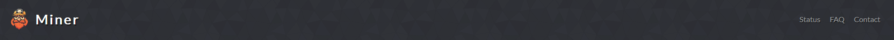
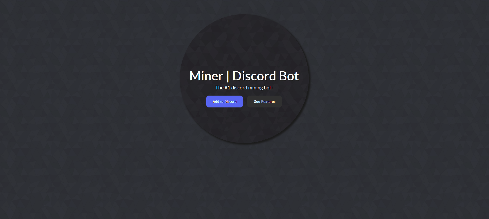
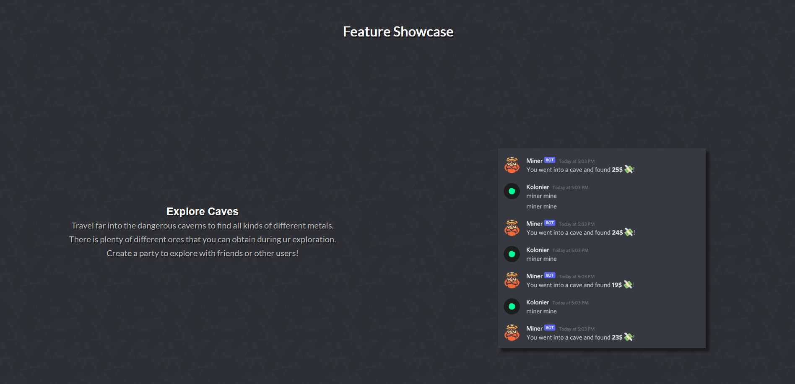
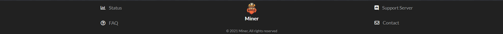
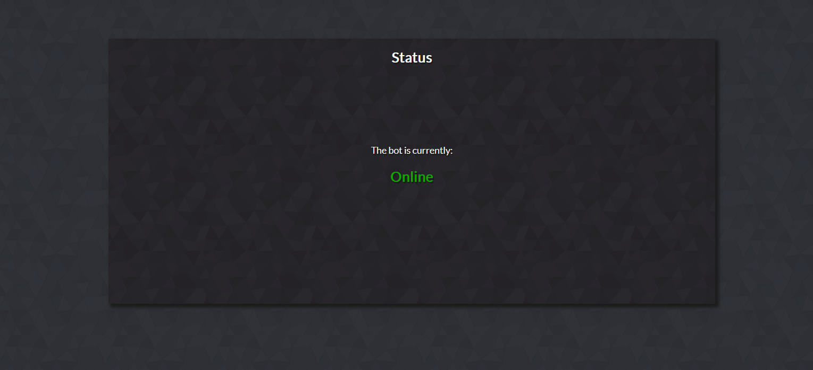
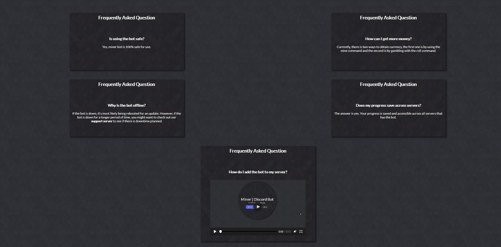
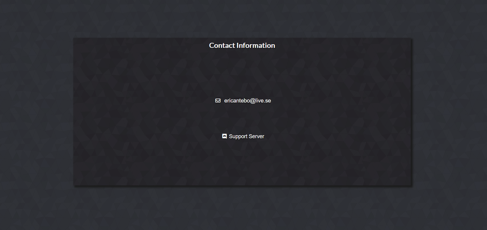

# Miner

Miner is a site made for a discord bot that hopefully will help make the bot's usage alot easier. The site will be targeted towards discord servers that are in need of a new and fun mining bot. This website will be useful for users that wants to know more about the bot. 

---

## Features

### Current Features

- __Navigation Bar__

    - All pages feature a navigation bar with a home, status, FAQ and contact page which stays identical on every page for easy navigation.
    - The navigation bar allows users to easily access all of the websites pages.

- __Landing Section__

    - The landing section contains a circle with text to let the users know what the site is about. The circle also has two buttons on it, one of them invites the bot to your discord server and the other brings you further down on the page to the feature showcase.
    - The landing section tells the user what the site while still being simple at the same time.

- __Feature Showcase Section__

    - This section showcases the features of the bot with some lines of text describing the section and a picture showing the commands for said feature.
    - When the user sees this, he/she will get insight on how the bot works and hopefully make the decision to add it to he/she's server.

- __Footer__

    - The footer provides links to our contact, FAQ, status and support server. They will all open in a new link allowing easy navigation for the user.
    - The footer acts like a second navigation bar for easier access to navigation.

- __Status Page__

    - This page will show if the bot is either offline or online.
    - The status page is valuable for when the bot is facing issues and the user don't know the current status of the bot, he/she can then go to this page to find out.

- __FAQ Page__

    - Our FAQ page shows five frequently asked questions with answers the last having a video as the answer for more flexibility.

    - This page will hopefully answer questions the user has before they have to ask it.

- __Contact Page__

    - The contact page shows the different ways to contact us.
    - This page will be able to help those who have questions that arent in the faq.

### Future Features

- __Leaderboard Page__

    - This will show the leaderboard for different stats, like the amount of money.

## Testing 

__Navigation Bar__

The navigation bar has links for the home, status, FAQ and contact page which stays identical on every page for easy navigation and works even when the screen gets smaller. On mobile screens the navigation bar changes to being underneath the logo instead of next to it.

__Landing Section__
The landing section has a circle in the middle of it. In this circle you can choose to add the bot to your discord server or go to the feature showcase, which is on the same page but underneath the landing section. Whenever the screen gets smaller this circle responds by growing smaller together with all the content inside of it.

__Footer__
The footer provides links to status, contact, faq and support server. It also contains a copyright mark together with the sites logo. The footer responds to smaller screens by sorting its content in a list like manner.

__Status Page__
The status page allows the user to see whenever the bot is offline or online. The box hosting the status of the bot responds to smaller screens by growing smaller in width to make sure it always stays in frame.

__FAQ__
The FAQ page answers the most frequently asked questions. One of the questions is answered through a video instead of text. The page responds to smaller screens by going from two column to one.

__Contact Page__
The contact page provides contact informations to users incase they would ever need it. As the status page, the contact page grows smaller in width whenever the screen gets smaller.

### Validator Testing 

- HTML
  - No errors were returned when passing through the official [W3C validator](https://validator.w3.org/nu/?doc=https%3A%2F%2Fcode-institute-org.github.io%2Flove-running-2.0%2Findex.html)
- CSS
  - No errors were found when passing through the official [(Jigsaw) validator](https://jigsaw.w3.org/css-validator/validator?uri=https%3A%2F%2Fvalidator.w3.org%2Fnu%2F%3Fdoc%3Dhttps%253A%252F%252Fcode-institute-org.github.io%252Flove-running-2.0%252Findex.html&profile=css3svg&usermedium=all&warning=1&vextwarning=&lang=en#css)

  ## Deployment

  - The site was deployed to GitHub pages. The steps to deploy are as follows: 
  - In the GitHub repository, navigate to the Settings tab 
  - From the source section drop-down menu, select the Master Branch
  - Once the master branch has been selected, the page will be automatically refreshed with a detailed ribbon display to indicate the successful deployment. 

The live link can be found here - https://code-institute-org.github.io/love-running-2.0/index.html 

## Credits

### Content

- All of the icons used were taken from [Font Awesome](https://fontawesome.com/)
- instructions on how to make a transition when hovering over a link was taken from [w3schools]https://www.w3schools.com/

